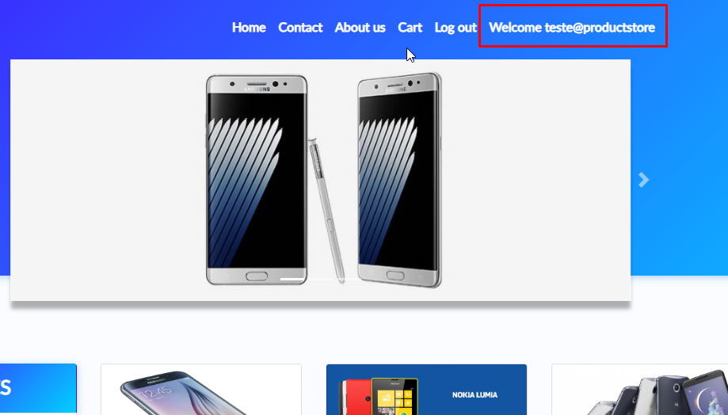
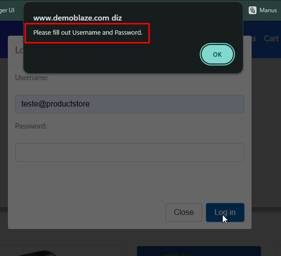
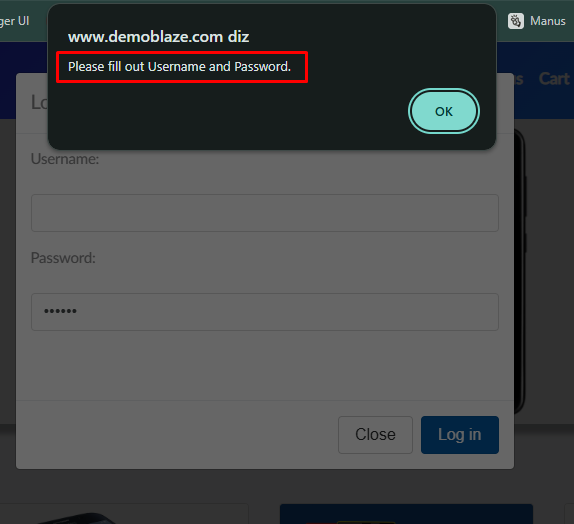
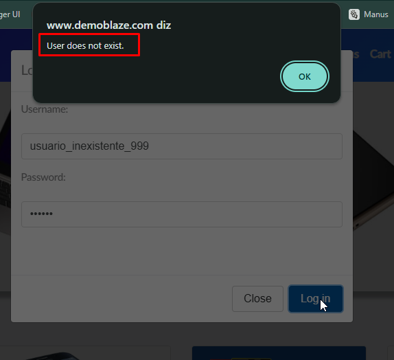
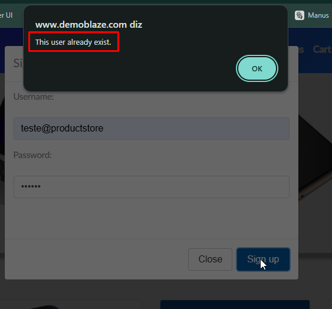
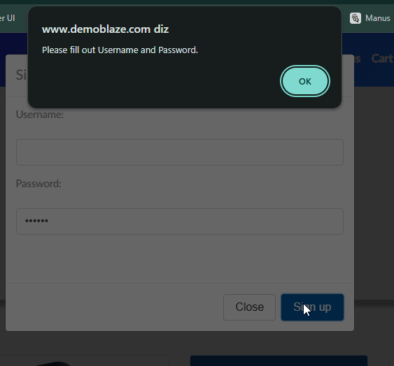
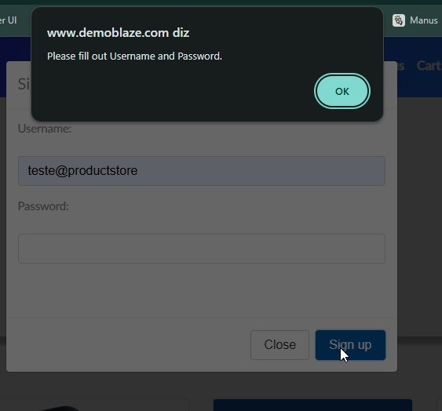

# Playwright Web - Automação de Testes de Login e Cadastro

## Descrição resumida

Este projeto foi desenvolvido para automatizar testes de interface web focados nos fluxos de login e cadastro de usuários em um site de demonstração, utilizando JavaScript e Playwright. A automação foi organizada com a abordagem de Page Object Model (POM), separando ações da interface, dados de teste e cenários de execução.

## Objetivo do projeto

O objetivo principal é validar o comportamento esperado das principais funcionalidades de autenticação e registro, cobrindo cenários de sucesso e validação de erros, com foco em qualidade, manutenção e legibilidade do código de automação.

## Tecnologias utilizadas

- JavaScript
- Playwright
- Node.js
- dotenv para leitura de variáveis de ambiente
- HTML report do Playwright
- Page Object Model (POM)

## Estrutura de pastas

```text
playwright-web/
├── .env
├── .gitignore
├── package.json
├── playwright.config.js
├── automacao/
│   ├── data/
│   │   ├── cadastro-cases.json
│   │   └── login-cases.json
│   ├── pages/
│   │   ├── cadastro.pages.js
│   │   └── login.pages.js
│   ├── testes/
│   │   ├── cadastro.spec.js
│   │   └── login.spec.js
│   └── utils/
│       └── test-data.js
├── screenshots/
│   ├── cadastro/
│   └── login/
└── README.md
```

> A estrutura acima representa os arquivos relevantes para a arquitetura da automação. Pastas como `node_modules`, `test-results` e `playwright-report` são artefatos de execução e não fazem parte da organização funcional do projeto.

## Arquitetura utilizada: Page Object Model (POM)

A arquitetura adotada neste projeto segue o padrão Page Object Model, que separa a definição dos elementos e ações de cada página da lógica dos cenários de teste.

### Como a estrutura foi organizada

- `automacao/pages/login.pages.js`: concentra as interações da página de login, como abrir a tela, preencher campos e validar mensagens.
- `automacao/pages/cadastro.pages.js`: concentra as interações da página de cadastro, incluindo preenchimento do formulário e confirmação de alertas.
- `automacao/testes/login.spec.js`: contém os cenários de teste de login, com chamadas aos métodos dos objetos de página.
- `automacao/testes/cadastro.spec.js`: contém os cenários de teste de cadastro.
- `automacao/data/login-cases.json`: armazena os dados dos casos de teste de login.
- `automacao/data/cadastro-cases.json`: armazena os dados dos casos de teste de cadastro.
- `automacao/utils/test-data.js`: realiza a substituição de variáveis de ambiente nos dados de teste.

### Vantagens do POM neste projeto

- Reuso das interações com a interface
- Melhor manutenção quando a tela muda
- Código de teste mais legível
- Separação clara entre dados, páginas e cenários

## Pré-requisitos

Antes de executar os testes, certifique-se de que o ambiente local está preparado:

- Node.js instalado
- npm instalado
- Navegador Chrome, Firefox e WebKit disponíveis para execução dos testes do Playwright

## Como instalar o projeto

1. Clone o repositório:

```bash
git clone <url-do-repositorio>
cd playwright-web
```

2. Instale as dependências:

```bash
npm install
```

3. Verifique se o Playwright foi instalado corretamente:

```bash
npx playwright --version
```

## Como configurar as variáveis de ambiente (.env)

O projeto utiliza `dotenv` para carregar variáveis de ambiente a partir do arquivo `.env`, localizado na raiz do projeto. Esse arquivo deve conter apenas valores necessários para os testes e nunca deve ser compartilhado com informações sensíveis reais.

Crie um arquivo `.env` na raiz do projeto com um conteúdo como este:

```env
SENHA_TESTE=sua_senha_de_teste
BASE_URL=https://www.demoblaze.com/index.html
USUARIO_TESTE=teste@productstore
```

### Observações

- O arquivo `.env` não deve ser publicado no GitHub com dados reais.
- `BASE_URL` é obrigatória e validada durante o carregamento de `playwright.config.js`. Se estiver ausente ou vazia, a execução é interrompida sem utilizar um valor padrão.
- O valor de `BASE_URL` é configurado em `use.baseURL`, e os Page Objects utilizam navegação relativa com `page.goto("/")`.
- `SENHA_TESTE` e `USUARIO_TESTE` são processadas pelo utilitário de substituição de variáveis em `automacao/utils/test-data.js`.
- O projeto já referencia essas variáveis em cenários de teste, sem expor informações confidenciais no código.

## Como executar todos os testes

Para rodar toda a suíte de automação:

```bash
npm test
```

Este comando executa a suíte configurada em `playwright.config.js` e utiliza os projetos configurados para Chromium, Firefox e WebKit.

## Como executar apenas os testes de login

```bash
npx playwright test automacao/testes/login.spec.js
```

Esse comando executa somente os cenários definidos no arquivo de login.

## Como executar apenas os testes de cadastro

```bash
npx playwright test automacao/testes/cadastro.spec.js
```

Esse comando executa somente os cenários definidos no arquivo de cadastro.

## Como executar os testes com interface gráfica

O projeto possui um comando específico para abrir a interface do Playwright em modo de execução visual:

```bash
npm run test:ui
```

Esse comando abrirá a interface do Playwright e permitirá acompanhar a execução dos testes de forma interativa.

## Como abrir o relatório HTML do Playwright

Para visualizar o relatório gerado pelo Playwright:

```bash
npm run test:report
```

Esse comando abre o relatório HTML em navegador, permitindo revisar resultados e detalhes dos testes executados.

## Casos de teste automatizados

### Login

| ID       | Cenário              | Pré-condição                                         | Passos resumidos                                                                              | Resultado esperado                                       |
| -------- | -------------------- | ---------------------------------------------------- | --------------------------------------------------------------------------------------------- | -------------------------------------------------------- |
| LOGIN-01 | Login com sucesso    | Usuário cadastrado com senha válida                  | Acessa a página de login; informa username e senha; clica em Log in                           | Usuário autenticado e mensagem de boas-vindas exibida    |
| LOGIN-05 | Login com senha incorreta | Usuário cadastrado com senha inválida            | Acessa a página de login; informa username existente e senha incorreta; clica em Log in       | Alerta exibido: "Wrong password."                       |
| LOGIN-02 | Login sem username   | Usuário deve preencher o campo obrigatório           | Acessa a página de login; deixa username vazio; informa senha; clica em Log in                | Alerta exibido: "Please fill out Username and Password." |
| LOGIN-03 | Login sem senha      | Usuário deve preencher o campo obrigatório           | Acessa a página de login; informa username; deixa senha vazia; clica em Log in                | Alerta exibido: "Please fill out Username and Password." |
| LOGIN-04 | Usuário sem cadastro | Usuário inexistente na base de dados de demonstração | Acessa a página de login; informa username e senha de usuário não cadastrado; clica em Log in | Alerta exibido: "User does not exist."                   |

### Cadastro

| ID     | Cenário                       | Pré-condição                               | Passos resumidos                                                                             | Resultado esperado                                       |
| ------ | ----------------------------- | ------------------------------------------ | -------------------------------------------------------------------------------------------- | -------------------------------------------------------- |
| CAD-01 | Cadastro de usuário existente | Usuário já cadastrado no sistema           | Acessa a tela de Sign up; informa username e senha de um usuário existente; clica em Sign up | Alerta exibido: "This user already exist."               |
| CAD-02 | Cadastro sem username         | Usuário deve preencher o campo obrigatório | Acessa a tela de Sign up; deixa username vazio; informa senha válida; clica em Sign up       | Alerta exibido: "Please fill out Username and Password." |
| CAD-03 | Cadastro sem password         | Usuário deve preencher o campo obrigatório | Acessa a tela de Sign up; informa username válido; deixa password vazio; clica em Sign up    | Alerta exibido: "Please fill out Username and Password." |

## Cenários em Gherkin

### Login

```gherkin
Funcionalidade: Login na aplicação

Cenário: Login com sucesso
Dado que o usuário acessa a página inicial
E possui uma conta cadastrada com username e senha válidos
Quando realiza o login com essas credenciais
Então o sistema deve autenticar o usuário
E exibir a mensagem de boas-vindas com o nome do usuário logado

Cenário: Login com senha incorreta
Dado que o usuário acessa a página de login
E possui uma conta cadastrada
Quando informa o username existente e uma senha incorreta
Então o sistema deve impedir o login
E exibir a mensagem "Wrong password."

Cenário: Login sem username
Dado que o usuário acessa a página de login
Quando tenta entrar sem informar o username
E informa uma senha válida
Então o sistema deve impedir o login
E exibir a mensagem "Please fill out Username and Password."

Cenário: Login sem senha
Dado que o usuário acessa a página de login
Quando informa um username válido
E tenta entrar sem informar a senha
Então o sistema deve impedir o login
E exibir a mensagem "Please fill out Username and Password."

Cenário: Usuário sem cadastro
Dado que o usuário acessa a página de login
Quando informa um username e senha que não existem no sistema
Então o sistema deve impedir o login
E exibir a mensagem "User does not exist."
```

### Cadastro

```gherkin
Funcionalidade: Cadastro de usuário

Cenário: Cadastro de usuário existente
Dado que o usuário acessa a página de cadastro
E informa um username já cadastrado
E informa uma senha válida
Quando tenta concluir o cadastro
Então o sistema deve rejeitar o cadastro
E exibir a mensagem "This user already exist."

Cenário: Cadastro sem username
Dado que o usuário acessa a página de cadastro
Quando tenta realizar o cadastro sem preencher o username
E informa uma senha válida
Então o sistema deve impedir o cadastro
E exibir a mensagem "Please fill out Username and Password."

Cenário: Cadastro sem password
Dado que o usuário acessa a página de cadastro
Quando informa um username válido
E tenta realizar o cadastro sem preencher a password
Então o sistema deve impedir o cadastro
E exibir a mensagem "Please fill out Username and Password."
```

## Evidências dos testes

As imagens abaixo são capturas históricas e ilustrativas dos cenários automatizados. Elas apoiam a apresentação do portfólio, não representam evidência de uma execução atual e encontram-se na pasta `screenshots` do projeto.

### Login

Não há screenshot versionada para o cenário "Login com senha incorreta".









### Cadastro







## Boas práticas utilizadas no projeto

- Organização por responsabilidades: páginas, dados e testes em estruturas separadas
- Uso de Page Object Model para reduzir duplicação e melhorar manutenção
- Separação dos dados de login e cadastro em arquivos JSON específicos
- Uso de variáveis de ambiente para evitar hardcoded sensitive values
- Validação explícita de alertas e mensagens esperadas
- Configuração do Playwright para execução em múltiplos navegadores
- Estrutura pronta para expansão com novos cenários de automação

## Possíveis melhorias futuras

- Adicionar testes para fluxo de logout
- Expandir a suíte para cobrir mais funcionalidades do sistema
- Integrar execução automática com CI/CD
- Gerar relatórios mais detalhados e anexos por falha
- Explorar parametrização mais robusta de dados de teste
- Organizar cenários em categorias e suites por módulo

## Conclusão

Este projeto demonstra aplicação prática de automação de testes web com Playwright e JavaScript, utilizando boas práticas de organização, manutenção e validação de comportamento em interface. A estrutura atual fornece uma base sólida para evolução em cenários mais abrangentes de QA automatizada.
